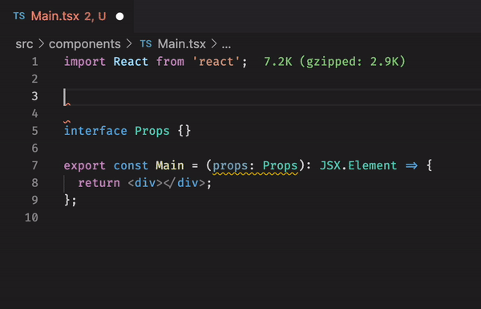
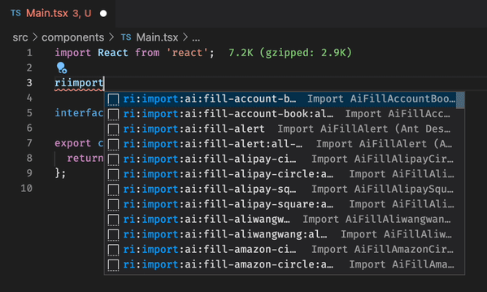

# ⛔ DEPRECATION NOTICE

### ⛔ This extension has been deprecated and is no longer being maintained.

## React-Icons Snippets

This extension includes 54,168 [React-Icons](https://react-icons.github.io/react-icons) snippets for VS Code. 

Build apps with 18,056 icons&mdash;across multiple icon libraries&mdash;all at your fingertips.

This extension supports:

- 🔣 All `react-icons` icons. The complete picture.
- 📦 `import` snippets, including `all-files` imports, for quick and easy importing.
- 🗃️ Libraries organized using a prefix, such as `ri:fa` for Font Awesome or `ri:im` for IcoMoon.

**Just type `ri` and press <kbd>Ctrl</kbd>+<kbd>Space</kbd> for autocompletion. VS Code will autocomplete the icon you need.**

Use a library prefix to filter by library. For example, `ri:fa:book`, `ri:im:user`, `ri:wi:cloud`, etc.

Read below for more information.

## 📚 Supported languages (file extensions)
- JavaScript (.js)
- JavaScript React (.jsx)
- TypeScript (.ts)
- TypeScript React (.tsx)

## 📖 Snippets

**All snippets start with `ri` for React-Icons, followed by the icon library prefix.**

There are 54,168 snippets available for icons and imports. Read more on each below.

### Library Prefixes

Icons are grouped by library using a prefix. See the table below for the prefix to use:

| Library                                                                          | Prefix | # Icons |
| -------------------------------------------------------------------------------- | ------ | ------- |
| [Ant Design Icons](https://react-icons.github.io/react-icons/icons?name=ai)      | `ai`   | 788     |
| [Bootstrap Icons](https://react-icons.github.io/react-icons/icons?name=bs)       | `bs`   | 668     |
| [BoxIcons](https://react-icons.github.io/react-icons/icons?name=bi)              | `bi`   | 738     |
| [css.gg](https://react-icons.github.io/react-icons/icons?name=cg)                | `cg`   | 704     |
| [Devicons](https://react-icons.github.io/react-icons/icons?name=di)              | `di`   | 192     |
| [Feather](https://react-icons.github.io/react-icons/icons?name=fi)               | `fi`   | 286     |
| [Flat Color Icons](https://react-icons.github.io/react-icons/icons?name=fc)      | `fc`   | 329     |
| [Font Awesome](https://react-icons.github.io/react-icons/icons?name=fa)          | `fa`   | 1559    |
| [Game Icons](https://react-icons.github.io/react-icons/icons?name=gi)            | `gi`   | 3786    |
| [Github Octicons Icons](https://react-icons.github.io/react-icons/icons?name=go) | `go`   | 184     |
| [Grommet-Icons](https://react-icons.github.io/react-icons/icons?name=gr)         | `gr`   | 562     |
| [Heroicons](https://react-icons.github.io/react-icons/icons?name=hi)             | `hi`   | 452     |
| [IcoMoon Free](https://react-icons.github.io/react-icons/icons?name=im)          | `im`   | 491     |
| [Ionicons 4](https://react-icons.github.io/react-icons/icons?name=io)            | `io4`  | 696     |
| [Ionicons 5](https://react-icons.github.io/react-icons/icons?name=io5)           | `io5`  | 1300    |
| [Material Design Icons](https://react-icons.github.io/react-icons/icons?name=md) | `md`   | 959     |
| [Remix Icon](https://react-icons.github.io/react-icons/icons?name=ri)            | `ri`   | 2172    |
| [Simple Icons](https://react-icons.github.io/react-icons/icons?name=si)          | `si`   | 1316    |
| [Typicons](https://react-icons.github.io/react-icons/icons?name=ti)              | `ti`   | 336     |
| [VS Code Icons](https://react-icons.github.io/react-icons/icons?name=vsc)        | `vsc`  | 319     |
| [Weather Icons](https://react-icons.github.io/react-icons/icons?name=wi)         | `wi`   | 219     |

### Icon Component Snippets

All `react-icons` components are supported.

For example, `ri:fa:book`, `ri:im:user`, `ri:wi:cloud`, etc.

The [React Icons website](https://react-icons.github.io/react-icons) has a searchable directory of all available icons.

### Import Snippets

Component import snippets are available for all `react-icons` components. 

All import snippets begin with `ri:import`.

For example, `ri:import:fa:book` will import `FaBook` from Font Awesome via the statement: `import { FaBook } from 'react-icons/fa';`.

Import snippets are also available for `all-files`, and these snippets all end with `:all-files`. 

For example, `ri:import:fa:book:all-files` will import `FaBook` from Font Awesome via the statement: `import { FaBook } from '@react-icons/all-files/fa/FaBook';`.

## You Might Also Like...

- [React-Bootstrap Snippets](https://marketplace.visualstudio.com/items?itemName=justinmahar.react-bootstrap-snippets) - Code snippets for React-Bootstrap

## Release Notes

### [1.0.0] - 2021-06-07

- Initial release of React-Icons Snippets.

### [1.0.1] - 2021-06-07

- Add gifs, update docs.

### [1.0.2] - 2021-06-07

- Refactor import prefixes. Update docs.

### [1.0.3] - 2021-06-07

- Update gifs, description, and docs.

### [1.0.4] - 2021-06-07

- Update docs.

### [1.0.5] - 2023-01-11

- Extension deprecated and no longer being maintained.